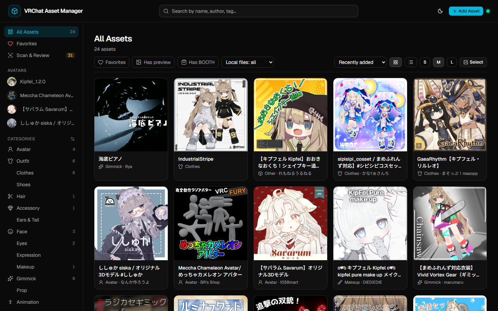
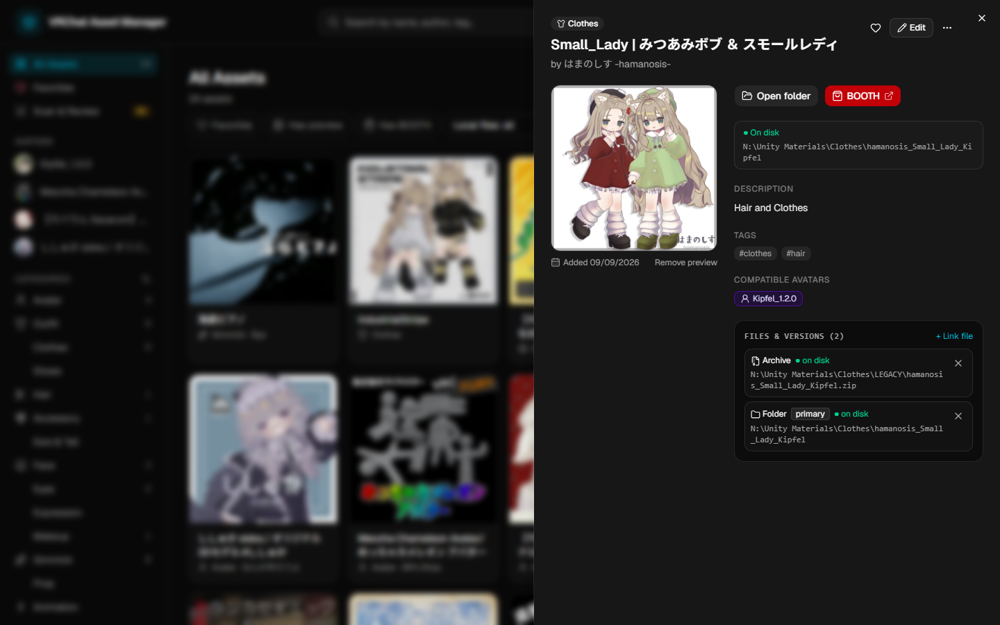
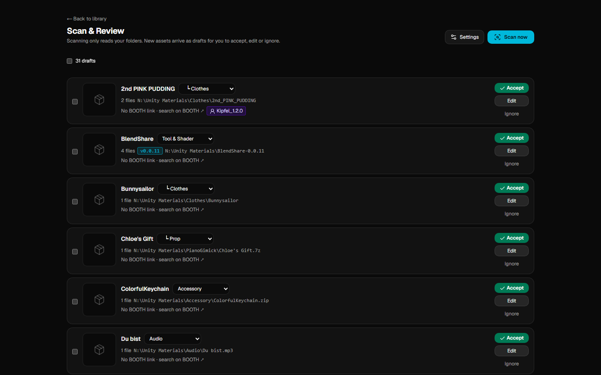
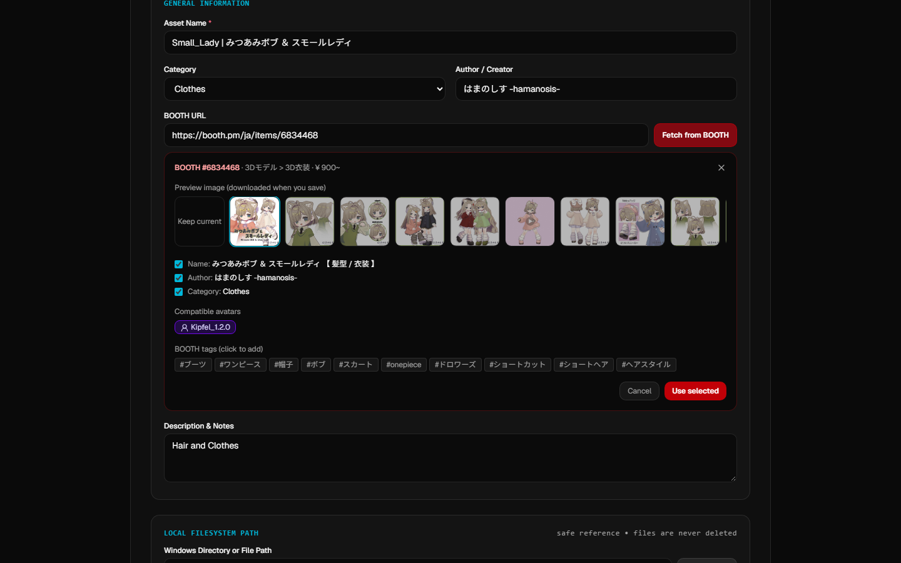
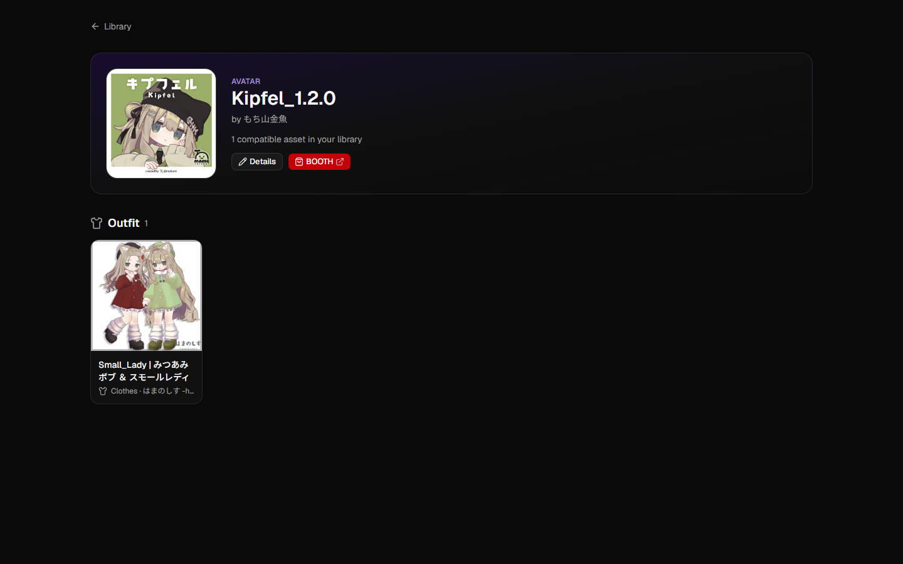
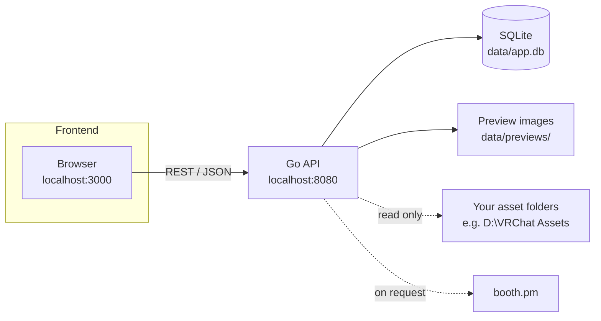
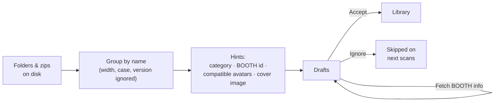

<div align="center">

# VRChat Asset Manager

**A local-first library for the VRChat assets you bought on BOOTH.**
See what you own, what it looks like, where it lives on disk, and which avatar it fits.


<picture>
  <source media="(prefers-color-scheme: light)" srcset="docs/screenshots/library-light.png">
  
</picture>

</div>

---

After a while, a VRChat folder turns into hundreds of zips and half-remembered folder names:
`hamanosis_Small_Lady_Kipfel`, `BukiyouTwinTail_1.1.0.zip`, `LEGACY/Gothic_Doll.zip`…
Which outfit was for which avatar? Where is the BOOTH page? Did I already extract that one?

VRChat Asset Manager answers those questions without moving a single file. It scans the folders you
already have, groups extracted folders with their original zips and older versions, pulls names and
preview images from BOOTH when you ask, and shows everything as a visual library on `localhost`.

## Features

### 📚 A visual library
Square preview cards (BOOTH images are 1:1) in three sizes or a compact list, a two-level category
tree, tags, favorites, search by name / author / tag, and filters such as *missing from disk* or
*has BOOTH link*. Click a card to open it in a side drawer without losing your place.

<p align="center"></p>

### 🔍 Scan your existing folders
Point the scanner at your asset folder and it proposes one draft per asset:

- **Level 1 folders are categories** (`Clothes`, `Hair`, `Models`…), level 2 entries are assets.
- **Zips are matched to their extracted folder** even when the names differ in case, width,
  separators or version (`Gothic Doll` ↔ `LEGACY/Gothic_Doll.zip`), and even across categories.
- **Versions are grouped**: `Kipfel_1.1.1`, `Kipfel_1.2.0` and `Zips/Kipfel v1.1.1.zip` become one asset.
- **BOOTH links are found** in folder names (`4460917 avatargimmick…`) and in readme / `.url` files,
  skipping dependencies such as lilToon.
- **Cover images** (`main.png`) become the preview.

Nothing is added until you accept it on the review screen. Re-scanning only reports what is new.

<p align="center"></p>

### 🛒 BOOTH import, on demand
Paste a BOOTH link and press **Fetch from BOOTH**: pick a preview image and copy the item name, shop,
category, tags and the avatars it supports. Works in bulk for scanner drafts too.

<p align="center"></p>

### 👤 Avatar-first
Mark which avatars an outfit, hair or accessory fits — by hand, in bulk, or from the item's
"対応アバター" list on BOOTH. Each avatar gets a page with everything compatible, grouped by category.

<p align="center"></p>

### ✨ Comfortable to use
- Drop or paste (Ctrl+V) an image to set a preview
- Multi-select to set a category, add a tag or mark compatibility for many assets at once
- One asset can track several folders, archives and versions, each with an *on disk / missing* status
- **Open folder** jumps straight to the files in Explorer
- Dark, light or system theme

## Your files stay yours

| | |
|---|---|
| **Local-first** | Everything is stored in a SQLite file in `data/`. No account, no cloud. |
| **Read-only on your library** | The app never moves, renames or deletes your asset files. Deleting or ignoring an entry only removes the library record and its preview copy. |
| **Private folders are skipped** | Folders in the *Never scan* list (by default `AvatarPass`) are never opened. |
| **BOOTH only when you ask** | booth.pm is contacted only when you press a fetch button, at most once per second; items are cached for a week. Preview images are downloaded, never hotlinked. |
| **Backups before upgrades** | Before applying a database migration, the backend copies `app.db` to `data/backups/`. |

## How it works



The scanner turns folders into drafts you confirm:



**Stack** — Next.js 16 (App Router), TypeScript, Tailwind CSS 4, shadcn/ui (Radix) and lucide icons on the
frontend; a Go standard-library HTTP server with the pure-Go `modernc.org/sqlite` driver and plain SQL
migrations on the backend.

## Getting started

### Requirements

- [Go](https://go.dev/dl/) 1.25 or newer
- [Node.js](https://nodejs.org/) 20.9 or newer

### Run it

Start the backend (it creates `data/app.db` and applies migrations on first run):

```bash
cd backend
go run .
```

In a second terminal, start the frontend:

```bash
cd frontend
npm install
npm run dev
```

Open **http://localhost:3000**.

> For everyday use, `npm run build` followed by `npm start` serves a faster production build.

### First steps

1. **Scan & Review** (sidebar) → **Settings** → add your asset folder and check the
   *folder name → category* table, then **Save**.
2. **Scan now**, look through the drafts, and **Accept** the ones you want — in bulk if you like.
3. Select drafts that have a BOOTH link and press **Fetch BOOTH info** to fill names and previews.
4. Open your avatars once with **Fetch from BOOTH** too: their Japanese names (e.g. キプフェル) help
   the app recognise which items fit them.

Prefer to start by hand? **Add Asset** in the header works without any scanning.

### Configuration

| Variable | Where | Default |
|---|---|---|
| `PORT` | backend | `8080` |
| `DB_PATH` | backend | `data/app.db` (relative to the repository) |
| `PREVIEWS_DIR` | backend | `data/previews` |
| `NEXT_PUBLIC_API_URL` | `frontend/.env.local` | `http://localhost:8080` |

The backend accepts browser requests from `http://localhost:3000`.

## Project structure

```text
├── backend/
│   ├── main.go              # HTTP server, routes, startup backup + migrations
│   ├── migrations/          # Plain SQL migrations, embedded in the binary
│   ├── internal/
│   │   ├── asset/           # Assets, files & versions, compatibility, previews, bulk edit
│   │   ├── category/        # Two-level category tree
│   │   ├── scanner/         # Folder scanner, name matching, drafts
│   │   ├── booth/           # BOOTH lookup, cache, suggestions
│   │   └── database/        # SQLite connection, migrations, backups
│   └── cmd/                 # seed (sample data) and verify (end-to-end checks)
├── frontend/
│   ├── app/                 # Library, asset, avatar, review and category pages
│   ├── components/          # Cards, drawer, forms, scanner and BOOTH panels
│   │   └── ui/              # shadcn/ui components
│   └── lib/                 # API client and helpers
├── data/                    # Your database, previews and backups (git-ignored)
├── docs/                    # API reference and screenshots
└── PROJECT_SPEC.md          # Specification and milestone history
```

## Development

```bash
# Backend tests (asset, category, scanner, BOOTH and database packages)
cd backend && go test ./...

# Frontend checks
cd frontend && npx tsc --noEmit && npm run lint && npm run build

# Sample data for an empty database
cd backend && go run ./cmd/seed
```

The REST API is documented in [docs/API.md](docs/API.md). Design decisions and the milestone history live in
[PROJECT_SPEC.md](PROJECT_SPEC.md).

## Roadmap

Done: asset CRUD, previews, search and tags, category tree, files & versions, avatar compatibility,
folder scanner with review, BOOTH import, refreshed UI with drawer, bulk edit, avatar pages and themes.

Ideas for later:

- **Collections** — named groups such as "Halloween" or "Avatar build #1"
- **Avatar builds** — save a full look: avatar + hair + outfit + accessories
- **Duplicate detection** — by BOOTH link or file hash
- **Optional Google Drive backup** of the database

---

<sub>Not affiliated with VRChat Inc. or pixiv Inc. (BOOTH). Item names and images belong to their creators.</sub>
